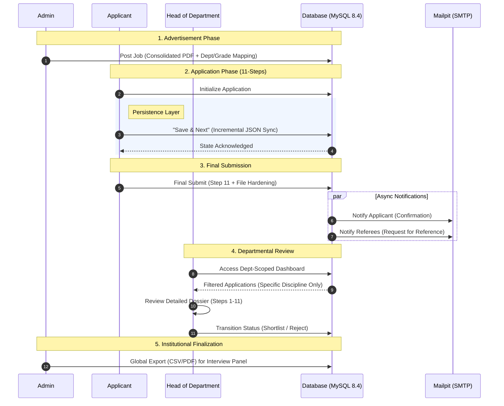

# Faculty Recruitment System (FRS)

<div align="center">


</div>

<br>

**The Faculty Recruitment System (FRS)** is an enterprise-grade recruitment engine designed to modernize academic hiring workflows through secure, state-persistent application pipelines. Built exclusively for **IIT Indore**, it empowers the institute to manage high-volume faculty applications with departmental precision. FRS bridges the gap between complex data collection and rapid, role-based decision-making by utilizing robust background queuing, real-time caching, and dynamic PDF generation.

## Tech Stack

| Layer | Technology |
| :--- | :--- |
| **Backend Core** | PHP 8.4.10, Laravel 12.54.1 |
| **Frontend** | React 18, Inertia.js |
| **UI & Styling** | Tailwind CSS, Shadcn UI, Framer Motion |
| **Database** | MySQL |
| **Cache, Session & Queue**| Redis |
| **PDF Generation** | DomPDF |
| **Infrastructure** | CloudPanel (Nginx, PHP-FPM), Docker (Sail for local dev) |

## System Architecture

The FRS is engineered for reliability and developer productivity, utilizing a modern monolithic approach with a decoupled frontend experience.

### The Inertia Bridge
This system leverages **Inertia.js** to bridge the gap between Laravel and React. This allows for a Single Page Application (SPA) feel without the complexity of maintaining a separate REST or GraphQL API. 
* **Global State:** The `HandleInertiaRequests` middleware automatically shares the authenticated user's profile and session flash messages (success/error) with the React frontend.
* **Server-Side Routing:** Routing is handled entirely by Laravel, with Inertia managing the component rendering on the client side.

### Dockerized Environment (Laravel Sail)
The entire development stack is containerized using **Laravel Sail**, ensuring environment parity across all development machines.
* **PHP Runtime:** PHP 8.4.10.
* **Database:** MySQL 8.4.
* **Email Testing:** Mailpit integration for capturing outgoing recruitment and referee notifications.
* **Utilities:** phpMyAdmin is included for direct database management during development.

### 11-Step Application State
To support the intensive data collection required for academic hiring, the system implements a robust "Save as Draft" mechanism.
* **Database Persistence:** Instead of ephemeral session storage, the system uses a `json` column (`form_data`) in the `job_applications` table to persist the state of all 11 steps.
* **Draft Logic:** The `RecruitmentController` uses an `updateOrCreate` strategy, allowing applicants to save their progress at any step without triggering full-form validation.
* **Data Casting:** Laravel's Eloquent casting automatically transforms the JSON blob into a manageable PHP array for the backend and a JSON object for the React frontend.

## Visual Workflow

The following Sequence diagram illustrates the data flow and role interactions.



## Feature Deep-Dive

This section highlights the specialized functionalities implemented for each user role, focusing on the technical architecture of the recruitment lifecycle.

### Admin: Institutional Oversight

- **Advertisement Management**  
  Dynamic creation of job postings with support for consolidated PDF uploads and multi-department targeting.

- **Dynamic Discipline Configuration**  
  A full CRUD interface for managing the institution's department list, ensuring the recruitment pool stays aligned with academic restructuring.

- **HOD Assignment Matrix**  
  Granular control over faculty roles, allowing admins to promote users to HOD status and bind them to specific departmental silos.

- **Global Dossier Access**  
  Cross-departmental search and filtering of all submitted applications with bulk export capabilities for institutional reporting.

### Applicant: The 11-Step Wizard

- **State Persistence Layer**  
  Utilizes a `json` column (`form_data`) to store dense academic data (publications, patents, research plans), enabling a seamless "resume-anytime" draft experience.

- **Role-Specific Dashboard**  
  Real-time tracking of application statuses (*Submitted, Shortlisted, Rejected*) and a centralized hub for downloading generated dossiers.

- **Referee Automation**  
  Integrated dispatch of `RefereeNotification` emails to all listed referees via Mailpit-verified SMTP triggers upon finalization.

- **Export Engine**  
  On-the-fly generation of professionally formatted PDFs using `dompdf` and detailed Excel dossiers for personal record-keeping.

### HOD: Departmental Review 

- **Security Scoping**  
  Architectural implementation of departmental silos; HODs are locked into their assigned discipline via backend query scoping, preventing unauthorized access to other departments.

- **Dossier Deep-Dive**  
  A specialized review interface built with collapsible Shadcn/UI components to navigate complex 11-step applicant data efficiently.

- **Status Transition Workflow**  
  Single-click decision pipeline allowing HODs to move applicants from *"Awaiting Review"* to *"Shortlisted"* or *"Rejected"* states.

- **Committee Exports**  
  Ability to generate department-specific CSV summaries for offline review during faculty selection committee meetings.

## Installation 

Follow these steps to get the Faculty Recruitment System running locally using **Laravel Sail**.


### Prerequisites
- **Docker Desktop** installed and running  
- **Node.js & npm** installed on your host machine (for initial frontend builds)

---

### Step-by-Step Setup

#### 1. Clone the Repository & Environment Setup
```bash
git clone https://github.com/varunbalaji167/FRS_Laravel.git
cd frs_laravel
cp .env.example .env
```

---

#### 2. Install Dependencies  
Since the PHP environment is containerized, use a temporary container to install composer dependencies:

```bash
docker run --rm \
    -u "$(id -u):$(id -g)" \
    -v "$(pwd):/var/www/html" \
    -w /var/www/html \
    laravelsail/php84-composer:latest \
    composer install --ignore-platform-reqs
```

---

#### 3. Start the Environment  
Launch the Docker containers in the background:

```bash
./vendor/bin/sail up -d
```

The system uses **PHP 8.5** and **MySQL 8.4** as defined in `compose.yaml`.

---

#### 4. Initialize Database & Key
```bash
./vendor/bin/sail artisan key:generate
./vendor/bin/sail artisan migrate --seed
```

---

#### 5. Frontend Development  
Install React dependencies and start the Vite dev server:

```bash
./vendor/bin/sail npm install
./vendor/bin/sail npm run dev
```

---

### Access Ports
- **Web Application:** http://localhost 
- **Mailpit (Email Testing):** http://localhost:8025  
- **phpMyAdmin:** http://localhost:8080  

---

## Directory Structure

The frontend is organized to maintain a clear separation between reusable UI components, global layouts, and specific page logic. Below is the structure of the `resources/js` directory:

```text
resources/js
├── app.jsx                 # Inertia.js bootstrapper and React entry point
├── bootstrap.js            # Axios and environment configuration
├── Components/             # Reusable UI library
│   ├── ui/                 # Shadcn/UI primitive components (Button, Input, etc.)
│   ├── ToastListener.jsx   # Global handler for Inertia flash notifications
│   └── ...                 # Form inputs and navigation components
├── Layouts/                # Persistent shells for different user roles
│   ├── AdminLayout.jsx     # Navigation for Super Admins
│   ├── HodLayout.jsx       # Scoped navigation for Department Heads
│   ├── ApplicantLayout.jsx # Specialized layout for the recruitment wizard
│   └── GuestLayout.jsx     # Layout for unauthenticated pages (Login/Register)
├── lib/
│   └── utils.js            # Tailwind CSS and class-merging utilities
└── Pages/                  # View components mapped to Laravel routes
    ├── Admin/              # Global management: Applications, Jobs, and Users
    ├── Hod/                # Departmental Module: Review and Shortlisting
    ├── Applicant/          # Candidate Dashboard and the 11-Step Wizard
    │   └── Steps/          # Individual components for the application stages
    ├── Auth/               # Authentication views (Password Reset, Login, etc.)
    ├── Profile/            # Shared Master Profile and security settings
    ├── Dashboard.jsx       # Dynamic landing page based on authenticated role
    └── Welcome.jsx         # Public-facing landing page
```

## API Endpoints & Role-Based Logic Flow

This section provides a technical map of the system's communication layer, categorized by user role. Each endpoint follows the **Inertia.js protocol**, where the backend provides a JSON state that the React frontend renders into a seamless SPA experience.

- Refer /routes/web.php and /routes/auth.php

---

### **1. Authentication Endpoints (Public & Guest)**

These endpoints manage user authentication using Laravel Breeze + Socialite.

#### **Authentication Routes**

| **Method** | **Endpoint** | **Controller Function** | **Flow** |
| --- | --- | --- | --- |
| GET | /register | RegisteredUserController@create | Render registration page |
| POST | /register | RegisteredUserController@store | Validate → Create user → Redirect |
| GET | /login | AuthenticatedSessionController@create | Render login page |
| POST | /login | AuthenticatedSessionController@store | Validate → Start session → Redirect |
| POST | /logout | AuthenticatedSessionController@destroy | Logout → Session destroyed |

---

#### **Social Authentication (Google OAuth)**

| **Method** | **Endpoint** | **Controller Function** | **Flow** |
| --- | --- | --- | --- |
| GET | /auth/google | SocialAuthController@redirect | Redirect to Google OAuth |
| GET | /auth/google/callback | SocialAuthController@callback | Handle Google response → Login/Register → Redirect |

---

#### **Password Management**

| **Method** | **Endpoint** | **Controller Function** | **Flow** |
| --- | --- | --- | --- |
| GET | /forgot-password | PasswordResetLinkController@create | Show reset request form |
| POST | /forgot-password | PasswordResetLinkController@store | Send reset link email |
| GET | /reset-password/{token} | NewPasswordController@create | Show reset form |
| POST | /reset-password | NewPasswordController@store | Reset password |
| PUT | /password | PasswordController@update | Update password (auth required) |

---

#### **Email Verification**

| **Method** | **Endpoint** | **Controller Function** | **Flow** |
| --- | --- | --- | --- |
| GET | /verify-email | EmailVerificationPromptController | Show verification notice |
| GET | /verify-email/{id}/{hash} | VerifyEmailController | Verify email |
| POST | /email/verification-notification | EmailVerificationNotificationController@store | Resend verification email |

---

### **2. Profile Management Endpoints (Authenticated)**

#### **User Profile**

| **Method** | **Endpoint** | **Controller Function** | **Flow** |
| --- | --- | --- | --- |
| GET | /profile | ProfileController@edit | Render profile page |
| PATCH | /profile | ProfileController@update | Update profile details |
| DELETE | /profile | ProfileController@destroy | Delete user account |

---

### **3. Applicant Recruitment Endpoints (Authenticated + role:applicant)**

#### **Applicant Dashboard & Applications**

| **Method** | **Endpoint** | **Controller Function** | **Flow** |
| --- | --- | --- | --- |
| GET | /dashboard | RecruitmentController@index | Show applicant dashboard |
| GET | /applications | RecruitmentController@myApplications | List user’s applications |
| GET | /applications/{id} | RecruitmentController@show | View single application |

---

#### **Application Export**

| **Method** | **Endpoint** | **Controller Function** | **Flow** |
| --- | --- | --- | --- |
| GET | /applications/{id}/export/pdf | RecruitmentController@exportPdf | Download PDF |
| GET | /applications/{id}/export/excel | RecruitmentController@exportExcel | Download Excel |

---

#### **Application Workflow**

| **Method** | **Endpoint** | **Controller Function** | **Flow** |
| --- | --- | --- | --- |
| GET | /apply/{advertisement} | RecruitmentController@showApplyForm | Show application form |
| POST | /apply/{advertisement}/draft | RecruitmentController@saveDraft | Save draft |
| POST | /apply/{advertisement}/submit | RecruitmentController@submitApplication | Submit final application |

---

### **4. Admin Management Endpoints (Authenticated + role:admin)**

> All routes prefixed with /admin
> 

---

#### **Admin Dashboard & Settings**

| **Method** | **Endpoint** | **Controller Function** | **Flow** |
| --- | --- | --- | --- |
| GET | /admin | AdminController@dashboard | Admin dashboard |
| GET | /admin/settings | AdminController@settings | Manage settings |
| POST | /admin/departments | AdminController@storeDepartment | Create department |
| DELETE | /admin/departments/{department} | AdminController@destroyDepartment | Delete department |

---

#### **User Management**

| **Method** | **Endpoint** | **Controller Function** | **Flow** |
| --- | --- | --- | --- |
| GET | /admin/users | AdminController@users | List users |
| POST | /admin/users | AdminController@storeUser | Create user |
| PATCH | /admin/users/{user}/role | AdminController@updateRole | Update role |
| DELETE | /admin/users/{user} | AdminController@destroyUser | Delete user |

---

#### **Job Management**

| **Method** | **Endpoint** | **Controller Function** | **Flow** |
| --- | --- | --- | --- |
| GET | /admin/jobs | RecruitmentController@adminIndex | List jobs |
| GET | /admin/jobs/create | RecruitmentController@create | Show job creation form |
| POST | /admin/jobs | RecruitmentController@store | Create job |

---

#### **Application Management (Admin)**

| **Method** | **Endpoint** | **Controller Function** | **Flow** |
| --- | --- | --- | --- |
| GET | /admin/applications | ApplicationController@index | List all applications |
| GET | /admin/applications/{id} | ApplicationController@show | View application |
| PATCH | /admin/applications/{id} | ApplicationController@updateStatus | Update status |
| GET | /admin/applications/{id}/export/pdf | ApplicationController@exportPdf | Export PDF |
| GET | /admin/applications/{id}/export/excel | ApplicationController@exportExcel | Export Excel |

---

### **5. HOD Endpoints (Authenticated + role:hod)**

> All routes prefixed with /hod
> 

---

#### **HOD Dashboard & Settings**

| **Method** | **Endpoint** | **Controller Function** | **Flow** |
| --- | --- | --- | --- |
| GET | /hod | AdminController@dashboard | HOD dashboard |
| GET | /hod/settings | AdminController@settings | View settings |

---

#### **Department Applications (Scoped)**

| **Method** | **Endpoint** | **Controller Function** | **Flow** |
| --- | --- | --- | --- |
| GET | /hod/applications | ApplicationController@index | List department applications |
| GET | /hod/applications/{id} | ApplicationController@show | View application |
| PATCH | /hod/applications/{id} | ApplicationController@updateStatus | Update status |
| GET | /hod/applications/{id}/export/pdf | ApplicationController@exportPdf | Export PDF |
| GET | /hod/applications/{id}/export/excel | ApplicationController@exportExcel | Export Excel |
