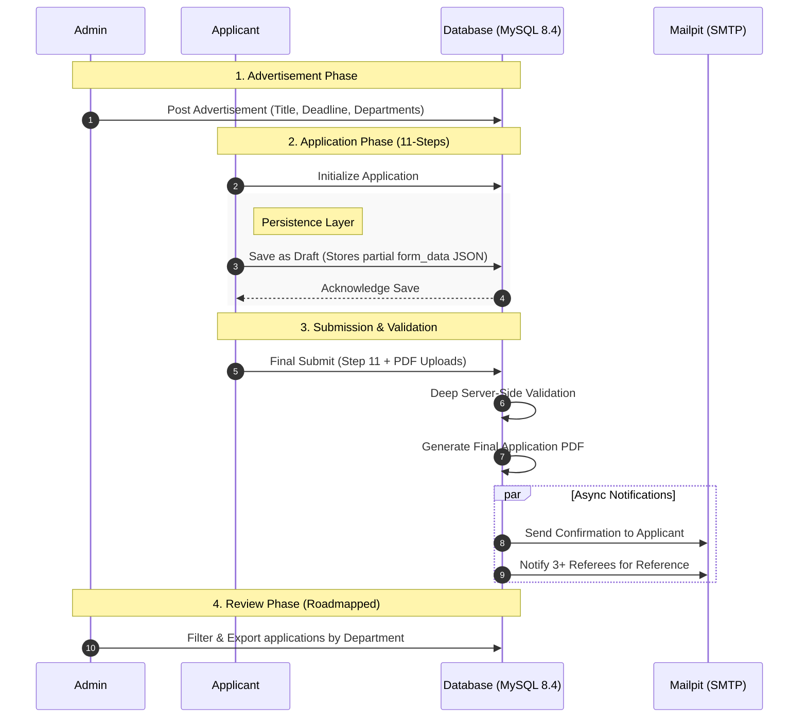

# Faculty Recruitment System (FRS)


A high-performance, multi-role recruitment engine designed to streamline academic hiring through an intuitive, persistent 11-step application workflow. Built for IIT Indore, it bridges the gap between complex data collection and seamless user experience using the Laravel-Inertia stack.

## Tech Stack

| Layer | Technology |
|------|-----------|
| Backend | Laravel 11 |
| Frontend | React (Inertia.js) |
| Styling | Tailwind CSS & Shadcn UI |
| Database | MySQL |
| DevOps | Docker (Laravel Sail) |

## System Architecture

The FRS is engineered for reliability and developer productivity, utilizing a modern monolithic approach with a decoupled frontend experience.

### The Inertia Bridge
This system leverages **Inertia.js** to bridge the gap between Laravel and React. This allows for a Single Page Application (SPA) feel without the complexity of maintaining a separate REST or GraphQL API. 
* **Global State:** The `HandleInertiaRequests` middleware automatically shares the authenticated user's profile and session flash messages (success/error) with the React frontend.
* **Server-Side Routing:** Routing is handled entirely by Laravel, with Inertia managing the component rendering on the client side.

### Dockerized Environment (Laravel Sail)
The entire development stack is containerized using **Laravel Sail**, ensuring environment parity across all development machines.
* **PHP Runtime:** PHP 8.5.
* **Database:** MySQL 8.4.
* **Email Testing:** Mailpit integration for capturing outgoing recruitment and referee notifications.
* **Utilities:** phpMyAdmin is included for direct database management during development.

### 11-Step Application State
To support the intensive data collection required for academic hiring, the system implements a robust "Save as Draft" mechanism.
* **Database Persistence:** Instead of ephemeral session storage, the system uses a `json` column (`form_data`) in the `job_applications` table to persist the state of all 11 steps.
* **Draft Logic:** The `RecruitmentController` uses an `updateOrCreate` strategy, allowing applicants to save their progress at any step without triggering full-form validation.
* **Data Casting:** Laravel's Eloquent casting automatically transforms the JSON blob into a manageable PHP array for the backend and a JSON object for the React frontend.

## Visual Workflow

The following Mermaid diagram illustrates the data flow and role interactions.



## Feature Deep-Dive

This section highlights the specialized functionalities implemented for each user role, focusing on the technical architecture of the recruitment lifecycle.

### Admin: Oversight & Management
* **Advertisement Management**: Dynamic creation and management of job postings, including title, deadline, and reference number tracking.
* **Multi-Discipline Targeting**: Capability to assign a single advertisement to multiple departments simultaneously to reach diverse academic pools.
* **Document Hosting**: Automated handling of official PDF advertisement uploads, securely stored and served from the public disk.

### Applicant: The 11-Step Wizard
* **Form Persistence**: Utilizes a `json` column (`form_data`) in the database to store partial application data, enabling a seamless "Save as Draft" experience across all 11 steps.
* **Dual-Layer Validation**: Implements a robust validation system where the backend mirrors frontend logic to ensure data integrity before final submission.
* **Referee Automation**: Integrated dispatch of `RefereeNotification` emails to all listed referees immediately upon application finalization.
* **PDF Export Engine**: Automated generation of a professionally formatted application summary using `dompdf` for candidate records and institutional filing.

### HOD: Departmental Review (Roadmapped)
* **Scoped Dashboards**: (Planned) Discipline-specific views that filter incoming applications based on the HOD's assigned department.
* **Decision Pipeline**: (Planned) Interface for transitioning applications from "Submitted" to "Shortlisted" or "Rejected" status.

## Installation 

Follow these steps to get the Faculty Recruitment System running locally using **Laravel Sail**.


### Prerequisites
- **Docker Desktop** installed and running  
- **Node.js & npm** installed on your host machine (for initial frontend builds)

---

### Step-by-Step Setup

#### 1. Clone the Repository & Environment Setup
```bash
git clone https://github.com/varunbalaji167/FRS_Laravel.git
cd frs_laravel
cp .env.example .env
```

---

#### 2. Install Dependencies  
Since the PHP environment is containerized, use a temporary container to install composer dependencies:

```bash
docker run --rm \
    -u "$(id -u):$(id -g)" \
    -v "$(pwd):/var/www/html" \
    -w /var/www/html \
    laravelsail/php84-composer:latest \
    composer install --ignore-platform-reqs
```

---

#### 3. Start the Environment  
Launch the Docker containers in the background:

```bash
./vendor/bin/sail up -d
```

The system uses **PHP 8.5** and **MySQL 8.4** as defined in `compose.yaml`.

---

#### 4. Initialize Database & Key
```bash
./vendor/bin/sail artisan key:generate
./vendor/bin/sail artisan migrate --seed
```

---

#### 5. Frontend Development  
Install React dependencies and start the Vite dev server:

```bash
./vendor/bin/sail npm install
./vendor/bin/sail npm run dev
```

---

### Access Ports
- **Web Application:** http://localhost 
- **Mailpit (Email Testing):** http://localhost:8025  
- **phpMyAdmin:** http://localhost:8080  

---

## Directory Structure

The frontend is organized to maintain a clear separation between reusable UI components, global layouts, and specific page logic. Below is the structure of the `resources/js` directory:

```text
resources/js
├── Components/
│   ├── ui/                 # Shadcn/UI primitive components (Button, Card, Input, etc.)
│   ├── ApplicationLogo.jsx
│   ├── ToastListener.jsx   # Global handler for Inertia flash messages
│   └── ...                 # Other reusable React components
├── Layouts/
│   ├── AdminLayout.jsx     # Sidebar and navigation for administrative roles
│   ├── ApplicantLayout.jsx # Specialized layout for the 11-step wizard
│   └── GuestLayout.jsx     # Layout for login/registration pages
├── lib/
│   └── utils.js            # Tailwind CSS class merging utilities
├── Pages/
│   ├── Admin/              # Management dashboards and job creation
│   ├── Applicant/          # Application tracking and read-only views
│   │   └── Steps/          # The 11 individual steps of the recruitment wizard
│   ├── Auth/               # Authentication views (Login, Register, etc.)
│   ├── Profile/            # User settings and profile management
│   └── Dashboard.jsx       # The main entry point for authenticated users
├── app.jsx                 # Inertia.js entry point and bootstrapper
└── bootstrap.js            # Axios and environment configuration
```

## API Endpoints & Role-Based Logic Flow

This section provides a technical map of the system's communication layer, categorized by user role. Each endpoint follows the **Inertia.js protocol**, where the backend provides a JSON state that the React frontend renders into a seamless SPA experience.

---

### 1. Authentication Endpoints (Public & Guest)

These endpoints manage user access and identity verification using Laravel Breeze and Socialite.

#### Authentication Routes

| Method | Endpoint | Controller Function | Flow |
|--------|----------|--------------------|------|
| GET | `/register` | RegisteredUserController@create | User → Controller → Inertia renders `Auth/Register.jsx` |
| POST | `/register` | RegisteredUserController@store | User submits form → Validate → Create user in DB → Redirect to Dashboard |
| GET | `/login` | AuthenticatedSessionController@create | User → Controller → Inertia renders `Auth/Login.jsx` |
| POST | `/login` | AuthenticatedSessionController@store | Validate credentials → Start session → Redirect |
| POST | `/logout` | AuthenticatedSessionController@destroy | Invalidate session → Redirect to home |

---

#### Social Authentication (Google OAuth)

| Method | Endpoint | Controller Function | Flow |
|--------|----------|--------------------|------|
| GET | `/auth/google` | SocialAuthController@redirectToGoogle | Redirect to Google OAuth |
| GET | `/auth/google/callback` | SocialAuthController@handleGoogleCallback | Google → Controller → Fetch user → Login/Create → Redirect |

---

#### Password Management

| Method | Endpoint | Controller | Flow |
|--------|----------|------------|------|
| GET/POST | `/forgot-password` | PasswordController | Request password reset |
| GET/POST | `/reset-password` | PasswordController | Reset password via token |
| PUT | `/password` | PasswordController | Update existing password |

---

### Applicant Recruitment Endpoints (Authenticated)

Handles the 11-step application process and applicant dashboard.

#### Applicant Features

| Method | Endpoint | Controller Function | Flow |
|--------|----------|--------------------|------|
| GET | `/dashboard` | RecruitmentController@index | Fetch advertisements → Check application status → Render dashboard |
| GET | `/my-applications` | RecruitmentController@myApplications | Fetch user applications → Format metadata → Render view |
| GET | `/jobs/{advertisement}/apply` | RecruitmentController@showApplyForm | Check draft → Render form with pre-filled data |

---

#### Application Actions

| Method | Endpoint | Controller Function | Flow |
|--------|----------|--------------------|------|
| POST | `/jobs/{advertisement}/draft` | RecruitmentController@saveDraft | Save partial data → `updateOrCreate` → Store as JSON draft |
| POST | `/jobs/{advertisement}/submit` | RecruitmentController@submitApplication | Validate → Store files → Update status → Trigger emails |
| GET | `/applications/{id}/export/pdf` | RecruitmentController@exportPdf | Generate PDF → Stream download |

---

### Administrative Management Endpoints (Admin Only)

Restricted via `CheckRole` middleware.

#### Admin Dashboard & Users

| Method | Endpoint | Controller Function | Flow |
|--------|----------|--------------------|------|
| GET | `/admin/dashboard` | AdminController@index | Aggregate stats → Render dashboard |
| GET | `/admin/users` | AdminController@users | Fetch all users → Render list |

---

#### Job & Application Management

| Method | Endpoint | Controller Function | Flow |
|--------|----------|--------------------|------|
| GET | `/admin/jobs` | RecruitmentController@adminIndex | List all advertisements |
| POST | `/admin/jobs` | RecruitmentController@store | Validate → Store PDF → Create advertisement |
| GET | `/admin/applications` | Admin\ApplicationController@index | Fetch all applications |
| GET | `/admin/applications/{id}` | Admin\ApplicationController@show | Retrieve full application → Render read-only view |

---

### Background Logic & Notifications

These processes are triggered internally (not direct endpoints).

#### Mail Services

| Service | File | Flow |
|--------|------|------|
| ApplicationSubmitted | `app/Mail/ApplicationSubmitted.php` | Sends email with PDF attachment to applicant |
| RefereeNotification | `app/Mail/RefereeNotification.php` | Sends email to referees for recommendations |

---

#### Storage Logic

| Type | Storage Path |
|------|-------------|
| Profile Images | `storage/app/public/applications/{user_id}/{adv_id}/photos` |
| Certificates | `storage/app/public/applications/{user_id}/{adv_id}/` |

---

### Profile Management Endpoints (Authenticated)

#### User Profile

| Method | Endpoint | Controller Function | Flow |
|--------|----------|--------------------|------|
| GET | `/profile` | ProfileController@edit | Render profile page |
| PATCH | `/profile` | ProfileController@update | Validate → Update user info |
| DELETE | `/profile` | ProfileController@destroy | Delete user + related applications |

---
